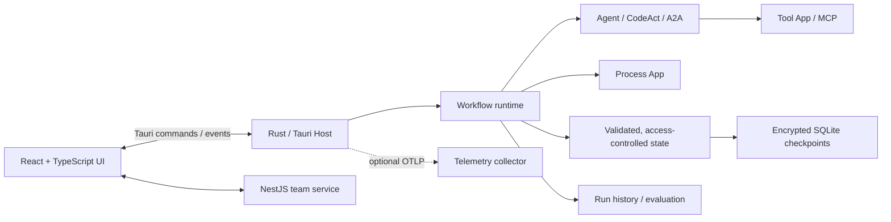

# Workrun

[English](README.md) | **简体中文**

> 本地优先的 AI 自动化工作台：独立运行 Python App，或用可视化工作流组合 Agent、App、MCP 工具与人工审核，再按需定时运行、评估和发布。

Workrun 面向想把一次性的 AI 对话沉淀为可复用自动化能力的开发者和团队。它将用户输入、模型推理、确定性代码、外部工具和人工审批组织为可执行工作流；你可以在画布上搭建流程，也可以维护完整的本地 Python 项目，并在每次运行后检查结果、轨迹和质量。

你可以先用一个独立的 Python App 完成数据处理、文件操作或系统集成，再将它接入工作流成为 Process 节点或 Agent 工具。个人模式无需登录；团队模式通过自托管 Workrun Server 共享资产与发布版本，实际运行仍在桌面端完成。

**[官方文档](https://workrun-docs.pages.dev/) · [中文文档](https://workrun-docs.pages.dev/zh-cn/) · [下载安装](https://github.com/1111mp/workrun-app/releases/latest) · [5 分钟快速开始](https://workrun-docs.pages.dev/zh-cn/getting-started/quickstart/)**

项目仍在快速迭代。本文概述当前能力；具体操作和使用边界请参阅官方文档。

<p align="center">
  
  
  
  
</p>

<p align="center">
  
  
  
  
</p>

## 你可以用 Workrun 做什么

- 从 Apps 页面独立运行 Python 项目，用表单、收集输入和确认交互完成本地任务。
- 将 Agent、Python App、MCP 工具、条件分支和人工操作组合成可视化工作流。
- 为 App 和工作流配置带时区的 Cron 定时任务，查看后续触发时间和运行记录。
- 管理可编辑的 Python 项目：既可作为工作流中的 Process 节点，也可作为 Agent 按需调用的 Tool App。
- 在运行面板查看节点状态、模型输出、工具调用、脚本日志和 OpenTelemetry 轨迹；失败后可从检查点重试。
- 用评估集批量回归工作流，比较版本结果，并以质量门约束发布。
- 在团队服务中发布带版本的工作流和 App；已发布工作流会固定引用对应版本的 Team App，保证复现性。

## 快速开始

### 下载安装

前往 [GitHub Releases](https://github.com/1111mp/workrun-app/releases/latest)，选择与你的操作系统和芯片架构匹配的安装包。实际可用平台与安装说明以 Release 页面为准。普通用户无需安装 Node.js、pnpm 或 Rust。

首次启动时选择个人或团队工作区。个人模式填写个人资料即可使用；团队模式需要填写 Workrun Server 地址并登录。

- **从 App 开始**：在 Apps 页面创建本地 Python 项目，编辑代码并直接运行；参见[Python App 指南](https://workrun-docs.pages.dev/zh-cn/guides/python-apps/)。
- **从工作流开始**：在 **设置 → 模型** 配置 Provider API Key（Ollama 配置端点），新建并连接 `Start → Agent → End`，为 Agent 选择对应模型，在 **更多设置 → 运行输入** 定义输入后运行；参见[快速开始](https://workrun-docs.pages.dev/zh-cn/getting-started/quickstart/)。

### 从源码运行：前置条件

- Node.js 24+
- pnpm 12（仓库锁定 `pnpm@12.6.0`）
- Rust 工具链与对应平台的 Tauri 构建依赖
- Python App 开发需要网络，以便 `uv` 下载 Python 与依赖；发行包会携带 `uv` sidecar

### 启动桌面端开发环境

```bash
pnpm install
pnpm app:dev
```

模型目录由 Workrun 内置，无需新建模型 Profile 或手动填写模型 ID；Provider 密钥加密保存在本机。完整环境说明见[安装与前置条件](https://workrun-docs.pages.dev/zh-cn/getting-started/installation/)。

### 常用命令

```bash
# 桌面端开发 / 仅启动前端
pnpm app:dev
pnpm ui:dev

# 检查
pnpm typecheck
pnpm oxlint
pnpm format
pnpm test

# 官方文档本地开发 / 构建
pnpm docs:dev
pnpm docs:build

# 团队服务（需 MongoDB 和认证环境变量）
pnpm server:dev
```

团队服务环境变量见 [apps/server/.env.example](apps/server/.env.example) 和 [env.validation.ts](apps/server/src/env.validation.ts)，包括 `MONGODB_URI`、`BETTER_AUTH_SECRET`、`SERVER_BASE_URL` 与 `BETTER_AUTH_URL`。部署说明见[团队发布与部署准备](https://workrun-docs.pages.dev/zh-cn/team/publishing/)。Python SDK 的开发与使用说明见 [packages/python-sdk/README.md](packages/python-sdk/README.md)。

## 核心能力

### 1. 工作流：从画布到可恢复执行

工作流支持任务与对话两种模式。画布提供 `Start`、`End`、`Agent`、`CodeAct Agent`、`Remote Agent`、`Process`、`If/Else`、`Switch`、`Human Review`、`Ask User Question`、`Subworkflow`、`Terminate` 和 `Group` 节点；`Group` 仅用于布局。

- 运行前会验证图结构、分支和输入/输出 JSON Schema，并编译为 Rust 执行图。
- `Subworkflow` 会传递上下文与暂停恢复信息，并阻止自引用、循环引用和过深嵌套；`Terminate` 可结束整次运行。
- 人工审核和提问会将执行状态写入本地 SQLite 检查点。用户提交结果后从暂停点继续，而非重跑已完成节点。
- 失败的后台运行可从检查点重试；当前要求检查点只剩一个待执行节点。运行记录保留执行计划、最终状态和关键事件。

```text
Start → 数据准备（Process） → Agent → Human Review → If/Else → End
                                  │             │
                                  │             └─ 审批后从检查点恢复
                                  └─ Tool App / MCP 工具调用
```

### 2. Agent、工具与模型

- Agent 可配置名称、职责、指令、内置模型、结构化输出、工具调用上限和超时；结果可写入指定状态字段，供后续节点和分支使用。
- 支持 Gemini、OpenAI 与兼容接口、Anthropic、DeepSeek、Groq、Ollama。
- 本地 Skills 兼容 Agent Skills 的 `SKILL.md` 格式，可渐进加载说明，并限制 Agent 可用工具。
- `CodeAct Agent` 在受限 Python 运行环境内编写和执行代码，支持迭代次数、工具调用数、时长、内存、目录挂载、环境变量和系统时钟限制。
- `Remote Agent` 通过 A2A（Agent-to-Agent）协议成为工作流中的一个执行节点。
- 工具可以来自本地 Tool App 或 MCP Server；可要求每次人工确认，拒绝会反馈给 Agent 以便调整方案。

### 3. Python App：保留代码工程化体验

App 可以从 Apps 页面独立运行，不需要先创建工作流；也可以配置定时任务，或接入工作流。每个 App 都是可自由编辑的本地 `uv` Python 项目，拥有自己的 `pyproject.toml`、锁文件、虚拟环境和入口脚本。桌面端负责创建环境、同步依赖和显示 stdout/stderr，但不会把业务代码塞进节点配置。

| 类型               | 在工作流中的角色                                     | 适用场景                           |
| ------------------ | ---------------------------------------------------- | ---------------------------------- |
| App / Process Node | 独立运行，或在工作流中读取获授权状态并返回结构化结果 | 数据处理、系统集成、确定性业务规则 |
| Tool App           | 由 Agent 按 JSON Schema 参数调用                     | 查询、计算、文件或服务操作         |

- Process App 通过 `workrun_sdk.process.result(...)` 返回结果。
- Python SDK 还提供 `form()`、`collect()`、`confirm()` 等 API，可经受令牌保护的本地 IPC 向桌面端请求表单或确认。
- 本地 App 不是沙箱：只运行你信任的代码，并按实际权限范围审查项目。

### 4. MCP Server：接入已有工具生态

可注册本地 `stdio` 或远程 Streamable HTTP MCP Server，测试连接、启停、重连并查看已发现工具。远程服务支持无认证、Bearer Token 和 OAuth；凭据仅以加密形式保存在本机。已启用 Server 中的工具可以被 Agent 选择，并同样受超时、调用额度、审批和运行追踪约束。

### 5. 状态、安全与可观察性

- 节点拥有隔离的状态命名空间；只有显式发布的字段才能共享，读取权限逐节点授予。
- 输入和节点输出可声明为敏感；检查点原始状态加密保存，对模型、工具和界面默认提供脱敏视图。
- 内置输入、输出和工具护栏：限制长度，脱敏常见 PII、中国大陆手机号和身份证号，并阻止凭据或认证秘密进入工具参数。
- 运行面板流式展示节点状态、模型消息、工具输入输出、脚本日志和轨迹。可配置 OTLP/gRPC collector，将诊断 Trace 导出到外部可观测性系统。

### 6. 评估、回归与发布质量

工作流编辑器内置 Evaluation lab，用评估集验证工作流变更：

- 创建、导入、排序、归档和恢复评估用例，批量执行用例并查看每项结果与失败原因。
- 对比两个版本的用例判定与评分标准，识别新增失败、回归和修复；失败用例可单独重试。
- 为工作流配置质量门，在发布前要求指定评估条件；必要时可记录带理由的人工豁免审计。
- 评估会保存对应工作流快照，避免把草稿变更误认为已发布版本的结果。

评测执行目前不支持包含 Process、CodeAct Agent 或 Remote Agent 的工作流，子工作流引用这些节点也会受限。人工节点需要手动处理；完整流程应结合正常运行与运行历史验证。参见[评测、回归与质量门](https://workrun-docs.pages.dev/zh-cn/quality/evaluations/)。

### 7. 定时运行

- App 和工作流支持持久化、时区感知的五字段 Cron，可预览接下来的触发时间，并编辑、暂停或恢复任务。
- 定时任务仅在 Workrun 桌面应用保持打开时执行；关闭期间错过的触发不会补跑。同一目标已排队、运行中或等待输入时会跳过本次触发，避免重叠执行。
- 本地工作流按最新保存的定义运行；团队工作流固定已发布版本。包含 Human Review 或 Ask User Question 节点的工作流无法保存为定时任务。

详见[定时运行指南](https://workrun-docs.pages.dev/zh-cn/guides/scheduled-runs/)。

### 8. 团队工作区与版本化资产

个人与团队工作区相互独立，切换模式不会自动共享个人资产。桌面端可连接自托管的 NestJS 团队服务并登录。团队服务负责身份、共享资产与发布版本，工作流和 Python App 仍由成员的桌面端执行。团队成员可以浏览和运行已发布的工作流，也可发布带语义版本的 Workflow 与 App。工作流发布时会校验引用；Team App 以不可变 release 固定到工作流版本，运行时按该 release 安装隔离副本，从而让历史运行和回归结果可复现。

## 架构概览



| 区域       | 位置                                       | 作用                                                      |
| ---------- | ------------------------------------------ | --------------------------------------------------------- |
| 桌面应用   | `apps/desktop`                             | React UI、React Flow 画布、运行面板、设置与团队体验       |
| 本地运行时 | `apps/desktop/src-tauri`                   | Rust 工作流编译/执行、状态与检查点、Python/MCP 管理、遥测 |
| 团队服务   | `apps/server`                              | NestJS、认证、团队 App / Workflow / 文件 API 与发布版本   |
| 官方文档   | `apps/docs`                                | Astro / Starlight 中英文文档、教程与演示媒体              |
| Python SDK | `packages/python-sdk`                      | App 结果协议和本地 IPC 表单/确认 API                      |
| 共享包     | `packages/ui`、`packages/json-schema-form` | UI 基础组件与 JSON Schema 表单                            |

## 演示

### Python App：创建与运行

<a href="https://github.com/1111mp/workrun-app/releases/download/resources/app.mp4">
  
</a>

### Workflow：配置并运行 Health Agent

<a href="https://github.com/1111mp/workrun-app/releases/download/resources/workflow.mp4">
  
</a>

## 项目状态与路线图

已具备独立 App、本地工作流、App/MCP 集成、定时运行、运行恢复、评估、遥测，以及团队发布和运行已发布工作流的基础能力。以下方向仍在持续完善，不应视为既有承诺：

- 更完整的资产同步、导入导出、模板和市场发现体验。
- 更丰富的节点、连接器、运行控制与可复现调试信息。
- 更成熟的权限、插件机制和跨平台运行时体验。
- 团队协作下更细粒度的版本、权限和发布流程。

## 参与贡献

欢迎围绕工作流节点与运行时、模型和工具集成、桌面端体验、Python SDK、评估体系、示例流程和文档贡献改进。较大的设计变更建议先通过 Issue 讨论。

## License

本项目采用 [LICENSE](LICENSE) 中的许可证。
