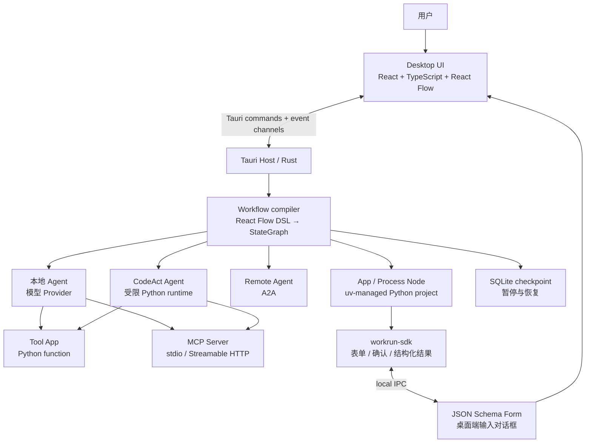

# Workrun

> 一个本地优先的 AI 自动化桌面平台：用可视化工作流编排 Agent，用可编辑的 Python App 与 MCP 工具把模型真正接入你的本机能力。

Workrun 面向希望把 AI 从“单次对话”变成“可复用、可运行的能力”的开发者。它把工作流、Agent、Python 项目和 MCP Server 放进同一个桌面 App：在画布上组合步骤和分支，为 Agent 配置模型、指令与工具；把本地代码沉淀为可独立调试、也可由工作流或 Agent 复用的 App；在一次运行里查看状态、模型输出、工具调用与脚本日志。

项目仍处于早期开发阶段，工作流文件格式与部分接口可能调整。本文标注的“已实现”能力以当前代码为准；尚未完成的方向集中列在文末路线图中。

<p align="center">
  
  
  
  
</p>

<p align="center">
  
  
  
  
</p>

## 它解决什么问题

许多 AI 自动化任务都会同时包含四类工作：向用户收集信息、调用 AI 推理、执行确定性的本地代码，以及访问外部工具或服务。若这些步骤散落在提示词、终端命令和多个工具中，流程不易复用，也很难知道某次运行在哪一步失败。

Workrun 将它们组织到同一份工作流中：

- **人机协作**：工作流启动时可显示输入表单；运行中的流程也可暂停，要求人审核内容、修改后批准/拒绝，或回答一个问题再按选择分支；Python App 也可在运行中向桌面端请求表单或确认。
- **AI 推理**：Agent 节点携带角色、指令和模型配置，读取当前工作流状态后生成结果。
- **可编程自动化**：Python App 以独立、可编辑的 `uv` 项目存在；既能作为画布节点处理工作流状态，也能成为 Agent 的 Tool App。
- **工具连接**：Agent 可选择本地 Tool App 或已连接 MCP Server 发现的工具，并可在调用前要求人工确认。
- **流程控制与可观察性**：If/Else、Switch 与人工决策节点根据状态字段或用户选择决定路径；运行面板流式显示节点状态、模型消息、工具调用、思考过程和脚本输出，并可从暂停处继续执行。

换言之，Workrun 不是又一个聊天窗口，而是把 AI 与本地程序纳入有输入、输出、分支和执行记录的工作流运行时。

## 当前已实现的能力

### 可视化工作流编辑与运行

- 基于节点画布创建、连接、保存和加载工作流，支持撤销/重做与工作流基本设置。
- 已提供 `Start`、`End`、`Agent`、`CodeAct Agent`、`Remote Agent`、`Process`、`If/Else`、`Switch`、`Human Review`、`Ask User Question` 与 `Group` 节点；其中 Group 仅用于画布布局，不参与执行。
- 工作流可配置为任务模式或对话模式；任务模式会根据输入定义生成测试运行表单，对话模式提供消息输入。
- 运行前会校验图结构并编译为执行计划：必须且只能有一个 Start、至少一个 End，边连接与分支出口也会被验证。
- 运行时将画布 DSL 编译为 Rust 工作流图，按事件流向界面发送节点开始/结束、模型消息与错误；最终状态、执行计划与中断状态会一并返回。

### 人在回路中的暂停、审核与分支

- `Human Review` 节点会保存检查点并暂停流程，等待用户批准或拒绝；可展示指定状态字段与附加上下文，并可允许用户直接编辑一个文本字段后再继续。
- `Ask User Question` 节点会暂停并展示预设选项；用户的选择写入工作流状态，并从对应出口继续执行。
- 暂停时的状态保存在本地 SQLite 检查点中。提交审核结论或问题答案后，流程会从保存的位置恢复，而不会重跑此前已完成的节点。

### Agent 与模型

- 本地 Agent 节点可配置名称、职责描述、指令和模型 Profile，并使用当前工作流状态作为上下文。
- Agent 可将完整的最终文本写入指定的工作流状态字段，便于后续审核、分支或其他节点继续处理。
- `CodeAct Agent` 可在受限的 Python 运行时中编写并执行代码来组合工具；可配置迭代/工具调用上限、脚本时限和内存上限，以及明确授权的目录挂载、环境变量与系统时钟。
- Remote Agent 节点通过 A2A（Agent-to-Agent）协议调用远程 Agent，作为工作流中的正式执行步骤。
- 设置页可管理模型提供商凭据和连接地址；当前运行时已接入 Gemini、OpenAI / OpenAI-compatible、Anthropic、DeepSeek、Groq 与 Ollama。
- API Key 以加密形式写入本地 Workrun 配置，而非交给前端持久化。
- 每个 Agent 可选择可用工具、设置单次运行的工具调用上限与超时；运行记录会保留工具输入、输出与调用过程。

### App：把本地 Python 代码变成可复用能力

Workrun 中的 App 是一个由桌面端管理、但始终可由你自由编辑的本地 Python 项目。创建后，App 会拥有自己的 `pyproject.toml`、锁文件、虚拟环境和入口脚本；Workrun 使用 `uv` 准备运行环境、同步依赖和流式返回日志。它不是把代码塞进节点配置，而是保留了完整项目的可维护性。

| 类型                  | 如何复用                                    | 适合的场景                                                                                                                                                        |
| --------------------- | ------------------------------------------- | ----------------------------------------------------------------------------------------------------------------------------------------------------------------- |
| **App（工作流 App）** | 单独运行，或作为 Process 节点加入任意工作流 | 数据处理、内部系统集成、确定性规则，以及需要清晰输入/输出的复杂业务逻辑。它从 stdin 接收完整工作流状态，并通过 `workrun_sdk.process.result(...)` 返回结构化结果。 |
| **Tool App**          | 由 Agent 按 JSON Schema 描述的参数自主调用  | 查询、计算、文件/服务操作等需要由模型决定何时调用的能力。用 Python SDK 的 `@tool` 定义函数，Agent 获得经过校验的结构化结果。                                      |

- App 可从 Apps 页面单独运行、调试和迭代；同一个本地项目不需要为工作流集成而牺牲正常的代码组织方式。
- Python SDK 提供 `form()`、`collect()`、`confirm()` 等 API；App 可通过受令牌保护的本地 IPC 请求桌面端显示 JSON Schema 表单，再继续执行。
- Tool App 可配置输入/输出契约、风险等级、权限说明与“每次询问”策略。需要确认时，桌面端会向用户展示本次调用参数再执行。
- App 是本机代码，不是沙箱：请仅运行你信任的项目，并按其实际权限范围审查代码。

### MCP Server：让 Agent 使用已有工具生态

除本地 Tool App 外，Workrun 还可把 MCP Server 注册为 Agent 可选择的工具来源：

- 支持本地 `stdio` Server 与远程 Streamable HTTP Server，可在 App 内测试连接、启停、重连并查看已发现的工具数量与连接错误。
- 远程 Server 支持无认证、Bearer Token 和 OAuth；凭据保存在本地加密配置中，前端不会收到密钥或 OAuth 凭据。
- Agent 节点从已启用 Server 发现的工具中按需选择；调用同样纳入超时、限额、审批和运行追踪。

### 桌面端与本地体验

- 基于 Tauri 2 的 React/TypeScript 桌面应用，前端画布使用 React Flow。
- 支持浅色、深色与跟随系统主题；中英文界面；日志等级和保留策略设置。
- 已集成自动检查更新、开机启动、静默启动、系统托盘、单实例和窗口状态等桌面能力（不同平台的实际可用性取决于系统支持）。

## 示例：健康报告工作流

下面是当前准备录制演示的视频场景：用户填写自身健康信息，Health Agent 根据这些输入生成一份健康报告。

```text
Start
  │
  ├─ 在运行面板填写：年龄、性别、身高、体重、生活习惯、关注点……
  │
  ▼
Health Agent
  ├─ 读取本次输入与 Agent 指令
  ├─ 调用已配置的模型
  └─ 生成健康报告（仅作健康信息整理，不替代医疗诊断）
  │
  ▼
End
```

同一流程可以自然扩展：在 Agent 前增加 Python App 做 BMI 或数据规范化；在 Agent 后按 `route` / `approved` 等状态使用 Switch 或 If/Else 分流；也可以把某一步替换为符合 A2A 协议的远程 Agent。

## 演示视频

### App：创建与运行 Python App

<a href="https://github.com/1111mp/workrun-app/releases/download/resources/app.mp4">
  
</a>

### Workflow：配置并运行 Health Agent

<a href="https://github.com/1111mp/workrun-app/releases/download/resources/workflow.mp4">
  
</a>

## 项目架构

Workrun 采用 pnpm monorepo。桌面端负责交互、工作流执行编排和本地运行时管理；共享包承载 UI 与动态表单能力；Python SDK 则是 App 与桌面端之间的受控交互层。



### 分层与职责

| 层              | 主要位置                                       | 职责                                                                                                                                |
| --------------- | ---------------------------------------------- | ----------------------------------------------------------------------------------------------------------------------------------- |
| 桌面界面        | `apps/desktop/src`                             | 工作流画布、节点编辑器、运行面板、Apps 管理、模型与应用设置。前端只描述工作流并展示结果，不直接持有执行逻辑。                       |
| 桌面主机        | `apps/desktop/src-tauri/src`                   | Tauri commands、配置与加密、系统集成、Python 运行时、App / MCP Server 注册表，以及工作流编译与执行。                                |
| 工作流运行时    | `module/workflow.rs`                           | 将 React Flow 的 `nodes` / `edges` 转成 ADK Rust `StateGraph`，验证图、连接条件边与人机节点，并以流式事件和本地检查点驱动界面状态。 |
| AI 与工具执行器 | `module/workflow`、模型配置                    | 创建本地 LLM Agent、CodeAct Agent 或 A2A Remote Agent；为 Agent 装配本地 Tool App 或 MCP 工具，并处理超时和人工审批。               |
| 本地 App 执行器 | `module/process_node`、`module/python_runtime` | 创建、登记、检查和执行 `uv` 管理的 Python 项目；将状态、日志和结构化结果接入工作流或 Agent。                                        |
| MCP 注册表      | `module/mcp_server`                            | 管理本地/远程 MCP Server 的配置、连接、认证、生命周期和工具发现。                                                                   |
| Python 交互 SDK | `packages/python-sdk`                          | 为 Python App 提供 `process.result()` 与 UI 请求 API，通过带令牌的本地 IPC 和桌面端通讯。                                           |
| 共享前端包      | `packages/ui`、`packages/json-schema-form`     | 复用基础组件，以及基于 RJSF/Ajv 的 JSON Schema 表单渲染能力。                                                                       |

### 一次工作流如何运行

1. 用户在画布定义节点、连线、输入字段和 Agent / App 配置，前端保存 React Flow 文档。
2. 点击运行后，前端收集本次输入并调用 Tauri command；这类运行参数属于本次执行，不会回写工作流定义。
3. Rust 端验证并编译文档，构建仅包含执行语义的 StateGraph。节点位置等画布布局信息不会进入运行时模型。
4. 图执行各个 Agent、CodeAct Agent、Remote Agent、App 与控制节点。Agent 可以调用已选的 Tool App 或 MCP 工具；状态在图中传递，If/Else 和 Switch 根据选择器字段决定后继路径。
5. `Human Review` 和 `Ask User Question` 会把当前状态写入本地检查点并中断运行。用户提交审核结论、修改内容或选择答案后，桌面端更新受限的状态字段并从检查点继续。
6. 执行事件通过 Tauri Channel 实时回到运行面板；App 的 stdout/stderr、Agent 的工具调用及其结果都会流式展示。结束后返回最终 state 与执行计划。

### 本地数据与安全边界

- 工作流定义、Workrun 配置、日志及 Process Node 项目均以本地文件为主。
- 模型推理请求会发送给用户所选模型服务；Remote Agent 节点会请求其配置的远程地址。因此，输入中包含敏感信息时，请审查对应模型服务和远程 Agent 的数据政策。
- Python App 与本地 stdio MCP Server 均由本机执行，应只运行你信任的代码。它们可以访问其被授予的本机权限；Workrun 不将其视为沙箱。
- CodeAct Agent 的 Python 执行环境会施加时长、内存和挂载目录限制；仍应仅向它提供必要的目录、环境变量和工具权限。

### 从本地资产到团队市场（规划中）

当前 Workrun 以本地文件为中心，便于个人在自己的设备上开发、试验和维护工作流与 App。后续计划引入服务端，用于集中保存这些可复用资产，并提供发布与分发能力。

设想中的团队市场会让成员把已经验证有效的工作流或 App 发布为可发现、可安装、可复用的能力。例如，某位同学沉淀了一个解决特定业务场景的工作流，或将复杂集成封装成 App 后，其他同学可在市场中找到它、复用它，并在自己的工作流中继续组合。版本、权限、依赖与发布流程将随该能力一并逐步设计。

> 这一服务端、发布与市场能力尚未实现；现阶段的工作流和 App 仍由本地桌面端管理。

## 仓库结构

```text
apps/desktop/                 Tauri 桌面应用
├── src/                      React UI、画布节点、运行面板与服务层
└── src-tauri/src/            Rust commands、运行时、配置与系统集成
packages/python-sdk/          Python App SDK（本地 IPC、表单、结果协议）
packages/json-schema-form/    JSON Schema 表单主题与模板
packages/ui/                  共享 UI 组件
```

## 本地开发

### 环境要求

- Node.js 24 或更高版本
- pnpm 11
- Rust 工具链（用于 Tauri 桌面应用）
- macOS/Linux 上运行 Python App 时，网络可用以便 `uv` 下载所需 Python / 依赖；生产包会随附 `uv` sidecar

### 常用命令

```bash
# 安装依赖
pnpm install

# 启动桌面应用开发环境
pnpm dev:app

# 仅启动前端界面
pnpm ui:dev

# 类型检查
pnpm typecheck

# 代码检查与格式检查
pnpm oxlint
pnpm format
```

Python SDK 的开发和测试说明见 [packages/python-sdk/README.md](packages/python-sdk/README.md)。

## 路线图

以下方向仍在持续完善中，不应视为已经完成的承诺：

- 服务端持久化、工作流 / App 的版本管理、发布机制与团队市场复用。
- 更完整的本地导入导出与可分享模板能力。
- 更丰富的节点类型、工具连接器、运行控制（取消、重试）与调试记录。
- 更成熟的权限模型、插件机制与更完善的跨平台运行时体验。
- 将运行历史、输入输出和错误上下文沉淀为更易复现的调试体验。

## 参与贡献

欢迎围绕工作流节点、运行时与插件机制、模型 / 工具集成、桌面端体验、Python SDK、示例流程和文档参与贡献。较大的改动建议先通过 Issue 讨论设计方向。

## License

本项目采用 [LICENSE](LICENSE) 中的许可证。
