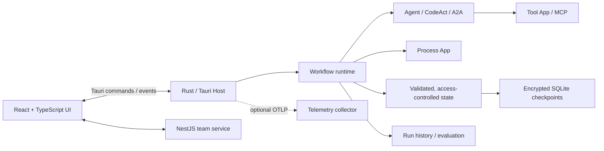

# Workrun

**English** | [简体中文](README-zh_CN.md)

> A local-first AI automation workbench: run Python apps independently, or build visual workflows with agents, apps, MCP tools, and human review, then schedule, evaluate, and publish them.

Workrun helps developers and teams turn one-off AI conversations into reusable automation. It brings user input, model reasoning, deterministic code, external tools, and human approval into executable workflows. Build on a visual canvas or maintain a complete local Python project, then inspect results, traces, and quality after each run.

Start with a standalone Python app for data processing, file operations, or system integration, then connect it to a workflow as a Process node or an agent tool. Personal mode requires no login. Team mode uses a self-hosted Workrun Server to share assets and published versions, while execution stays on the desktop.

**[Documentation](https://workrun-docs.pages.dev/) · [中文文档](https://workrun-docs.pages.dev/zh-cn/) · [Download](https://github.com/1111mp/workrun-app/releases/latest) · [5-minute quickstart](https://workrun-docs.pages.dev/getting-started/quickstart/)**

Workrun is evolving rapidly. This README summarizes current capabilities; see the official documentation for detailed instructions and limitations.

<p align="center">
  
  
  
  
</p>

<p align="center">
  
  
  
  
</p>

## What you can do with Workrun

- Run Python projects directly from Apps, using forms, input collection, and confirmation dialogs for local tasks.
- Compose agents, Python apps, MCP tools, conditional branches, and human decisions into visual workflows.
- Schedule apps and workflows with timezone-aware Cron, and inspect upcoming triggers and run history.
- Manage editable Python projects as workflow Process nodes or Tool Apps that agents call on demand.
- Inspect node status, model output, tool calls, script logs, and OpenTelemetry traces; retry failed runs from checkpoints.
- Run regression evaluations, compare version results, and enforce release quality gates.
- Publish versioned workflows and apps through the team service. Published workflows pin their Team App dependencies for reproducibility.

## Quick start

### Download and install

Visit [GitHub Releases](https://github.com/1111mp/workrun-app/releases/latest) and select the installer for your operating system and CPU architecture. Available platforms and installation instructions are listed on the release page. End users do not need Node.js, pnpm, or Rust.

On first launch, choose a personal or team workspace. In personal mode, complete your profile to get started. Team mode requires a Workrun Server URL and login.

- **Start with an app:** create a local Python project in Apps, edit its code, and run it directly. See the [Python app guide](https://workrun-docs.pages.dev/guides/python-apps/).
- **Start with a workflow:** configure a provider API key in **Settings → Models** (an endpoint for Ollama), connect `Start → Agent → End`, choose the corresponding model for the agent, and define inputs in **More settings → Run inputs** before running. See the [quickstart](https://workrun-docs.pages.dev/getting-started/quickstart/).

### Run from source: prerequisites

- Node.js 24+
- pnpm 12 (pinned to `pnpm@12.6.0` in this repository)
- Rust toolchain and the Tauri build dependencies for your platform
- Network access for Python app development so `uv` can download Python and dependencies; release packages include a `uv` sidecar

### Start desktop development

```bash
pnpm install
pnpm app:dev
```

Workrun includes a built-in model catalog; there is no need to create model profiles or enter model IDs manually. Provider credentials are encrypted locally. See [installation and prerequisites](https://workrun-docs.pages.dev/getting-started/installation/) for full setup instructions.

### Common commands

```bash
# Desktop development / frontend only
pnpm app:dev
pnpm ui:dev

# Checks
pnpm typecheck
pnpm oxlint
pnpm format
pnpm test

# Documentation development / build
pnpm docs:dev
pnpm docs:build

# Team service (requires MongoDB and authentication environment variables)
pnpm server:dev
```

Team service environment variables are defined in [apps/server/.env.example](apps/server/.env.example) and [env.validation.ts](apps/server/src/env.validation.ts), including `MONGODB_URI`, `BETTER_AUTH_SECRET`, `SERVER_BASE_URL`, and `BETTER_AUTH_URL`. See [team publishing and deployment preparation](https://workrun-docs.pages.dev/team/publishing/) for deployment guidance. Python SDK development and usage instructions are in [packages/python-sdk/README.md](packages/python-sdk/README.md).

## Core capabilities

### 1. Workflows: from canvas to resumable execution

Workflows support task and conversation modes. The canvas provides `Start`, `End`, `Agent`, `CodeAct Agent`, `Remote Agent`, `Process`, `If/Else`, `Switch`, `Human Review`, `Ask User Question`, `Subworkflow`, `Terminate`, and `Group` nodes. `Group` is for layout only.

- Graph structure, branches, and input/output JSON Schemas are validated before compilation into a Rust execution graph.
- `Subworkflow` propagates context and pause/resume information while preventing self-references, cycles, and excessive nesting. `Terminate` can end the entire run.
- Human review and questions persist execution state in local SQLite checkpoints. After the user responds, execution resumes from the pause point without rerunning completed nodes.
- Failed background runs can be retried from checkpoints, currently requiring exactly one pending node. Run records retain the execution plan, final state, and key events.

```text
Start → Data preparation (Process) → Agent → Human Review → If/Else → End
                                      │           │
                                      │           └─ Resume from checkpoint after review
                                      └─ Tool App / MCP tool calls
```

### 2. Agents, tools, and models

- Configure an agent's name, role, instructions, built-in model, structured output, tool call limits, and timeout. Results can be written to a designated state field for downstream nodes and branches.
- Supports Gemini, OpenAI and compatible APIs, Anthropic, DeepSeek, Groq, and Ollama.
- Local skills support the Agent Skills `SKILL.md` format, with progressive loading of instructions and restrictions on available tools.
- `CodeAct Agent` writes and executes code in a restricted Python runtime, with controls for iterations, tool calls, duration, memory, directory mounts, environment variables, and system clock access.
- `Remote Agent` integrates a remote agent as a workflow node through the A2A (Agent-to-Agent) protocol.
- Tools can come from local Tool Apps or MCP servers. Calls can require human approval; rejections are returned to the agent so it can adjust its approach.

### 3. Python apps: keep the code as a project

Apps run independently from the Apps page, without a workflow. They can also be scheduled or connected to workflows. Each app is an editable local `uv` Python project with its own `pyproject.toml`, lockfile, virtual environment, and entry script. The desktop manages environments, synchronizes dependencies, and displays stdout/stderr while keeping business logic in your project files.

| Type               | Role                                                                               | Use cases                                                         |
| ------------------ | ---------------------------------------------------------------------------------- | ----------------------------------------------------------------- |
| App / Process Node | Run independently, or read authorized workflow state and return structured results | Data processing, system integration, deterministic business rules |
| Tool App           | Called by an agent with JSON Schema parameters                                     | Queries, calculations, file or service operations                 |

- Process apps return results through `workrun_sdk.process.result(...)`.
- The Python SDK also provides `form()`, `collect()`, and `confirm()` APIs to request forms or confirmation from the desktop over token-protected local IPC.
- Local apps are not sandboxed: run trusted code and review projects according to their actual permissions.

### 4. MCP servers: connect existing tools

Register local `stdio` or remote Streamable HTTP MCP servers, test connections, start or stop them, reconnect, and inspect discovered tools. Remote servers support no authentication, Bearer Tokens, and OAuth; credentials are stored encrypted locally. Agents can select tools from enabled servers, subject to timeouts, call limits, approval, and run tracing.

### 5. State, security, and observability

- Nodes have isolated state namespaces. Only explicitly published fields are shared, and read access is granted per node.
- Inputs and node outputs can be marked sensitive. Raw checkpoint state is encrypted, while models, tools, and the UI receive redacted views by default.
- Built-in input, output, and tool guardrails enforce length limits, redact common PII including mainland Chinese mobile numbers and national ID numbers, and block credentials or authentication secrets from tool arguments.
- The run panel streams node status, model messages, tool inputs and outputs, script logs, and traces. Configure an OTLP/gRPC collector to export diagnostic traces to an external observability system.

### 6. Evaluations, regression checks, and release quality

The workflow editor includes an Evaluation lab for validating workflow changes:

- Create, import, reorder, archive, and restore evaluation cases; run them in batches and inspect individual results and failure reasons.
- Compare case verdicts and scoring criteria across two versions to identify new failures, regressions, and fixes. Failed cases can be retried individually.
- Configure quality gates that require evaluation conditions before publishing. When needed, record a manual waiver with a reason for auditing.
- Evaluations retain the corresponding workflow snapshot, keeping draft changes distinct from published-version results.

Evaluation execution currently does not support workflows containing Process, CodeAct Agent, or Remote Agent nodes, including references through subworkflows. Human nodes require manual handling. Validate complete flows with normal runs and run history. See [evaluations, regression checks, and quality gates](https://workrun-docs.pages.dev/quality/evaluations/).

### 7. Scheduled runs

- Apps and workflows support persistent, timezone-aware five-field Cron schedules. Preview upcoming triggers and edit, pause, or resume schedules.
- Schedules execute only while the Workrun desktop application is open. Missed triggers are not replayed after downtime. A trigger is skipped when the same target is already queued, running, or waiting for input, preventing overlapping execution.
- Local workflows use their latest saved definitions; team workflows pin published versions. Workflows containing Human Review or Ask User Question nodes cannot be saved as scheduled tasks.

See the [scheduled runs guide](https://workrun-docs.pages.dev/guides/scheduled-runs/).

### 8. Team workspaces and versioned assets

Personal and team workspaces are independent; switching modes does not automatically share personal assets. The desktop connects to a self-hosted NestJS team service with authentication. The service manages identity, shared assets, and published versions, while workflows and Python apps still execute on each member's desktop. Members can browse and run published workflows and publish semantically versioned workflows and apps. Publishing validates references and pins immutable Team App releases to the workflow version. At runtime, the desktop installs isolated copies of those releases so historical runs and regression results remain reproducible.

### 9. Open and run through deep links

Use **External invocation** on a saved App or Workflow to copy an open link or a run link. Workflow run links can include a URL-encoded JSON input object. Workrun waits for startup and login, then asks for confirmation and any missing inputs before submitting the run to its normal execution manager.

```text
workrun://v1/apps/{appId}
workrun://v1/apps/{appId}/run
workrun://v1/workflows/{workflowId}
workrun://v1/workflows/{workflowId}/run?input=%7B%22message%22%3A%22hello%22%7D&requestId=example-1
```

Links resolve IDs in the current workspace. Apps and workflow dependencies must already be available; links do not install them. App input parameters, automatic execution, and result callbacks are outside this first version. Keep secrets and large files out of URLs; links are limited to 32 KB.

`requestId` is optional. Reusing it with the same target and original input opens the existing run, including after restarting Workrun. Reusing it with different parameters reports a conflict. Without it, each new click can create a new run. Pending confirmations survive webview reloads, but are discarded when the desktop process exits. System protocol registration should be tested with an installed build, particularly on macOS.

## Architecture


```mermaid
flowchart LR
  UI[React + TypeScript UI] <-->|Tauri commands / events| Host[Rust / Tauri Host]
  Host --> Runtime[Workflow runtime]
  Runtime --> Agent[Agent / CodeAct / A2A]
  Runtime --> App[Process App]
  Agent --> Tools[Tool App / MCP]
  Runtime --> State[Validated, access-controlled state]
  State --> Checkpoint[Encrypted SQLite checkpoints]
  Runtime --> History[Run history / evaluation]
  Host -. optional OTLP .-> Collector[Telemetry collector]
  UI <--> Team[NestJS team service]
```

| Area            | Location                                   | Purpose                                                                                      |
| --------------- | ------------------------------------------ | -------------------------------------------------------------------------------------------- |
| Desktop app     | `apps/desktop`                             | React UI, React Flow canvas, run panel, settings, and team experience                        |
| Local runtime   | `apps/desktop/src-tauri`                   | Rust workflow compilation/execution, state and checkpoints, Python/MCP management, telemetry |
| Team service    | `apps/server`                              | NestJS, authentication, team app/workflow/file APIs, and published versions                  |
| Documentation   | `apps/docs`                                | Astro / Starlight documentation in English and Chinese, tutorials, and demo media            |
| Python SDK      | `packages/python-sdk`                      | App result protocol and local IPC form/confirmation APIs                                     |
| Shared packages | `packages/ui`, `packages/json-schema-form` | UI primitives and JSON Schema forms                                                          |

## Demos

### Python app: create and run

<a href="https://github.com/1111mp/workrun-app/releases/download/resources/app.mp4">
  
</a>

### Workflow: configure and run a Health Agent

<a href="https://github.com/1111mp/workrun-app/releases/download/resources/workflow.mp4">
  
</a>

## Project status and roadmap

Workrun currently provides standalone apps, local workflows, app/MCP integration, scheduling, run recovery, evaluations, telemetry, and team publishing and execution of published workflows. The following areas are still being developed and are not delivery commitments:

- More complete asset synchronization, import/export, templates, and marketplace discovery.
- More nodes, connectors, run controls, and reproducible debugging information.
- More mature permissions, plugin mechanisms, and runtime support across platforms.
- Finer-grained versioning, permissions, and publishing processes for team collaboration.

## Contributing

Contributions are welcome across workflow nodes and runtime, model and tool integrations, desktop experience, the Python SDK, evaluations, example workflows, and documentation. For substantial design changes, please open an issue for discussion first.

## License

This project is licensed under the terms in [LICENSE](LICENSE).
